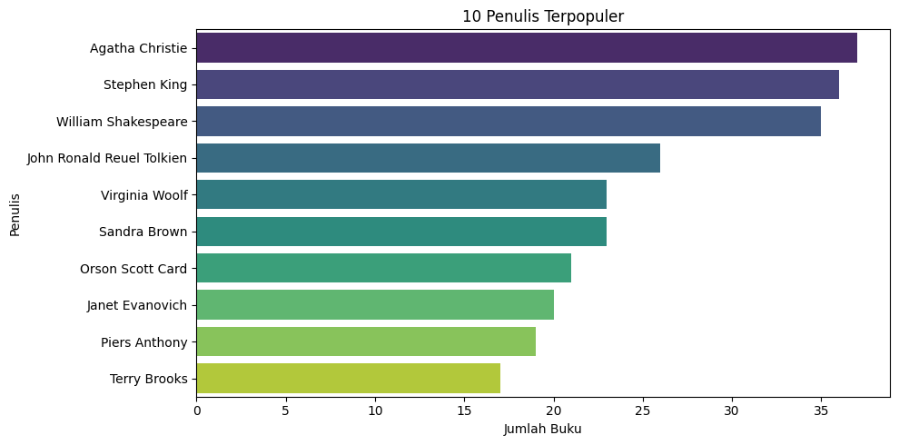
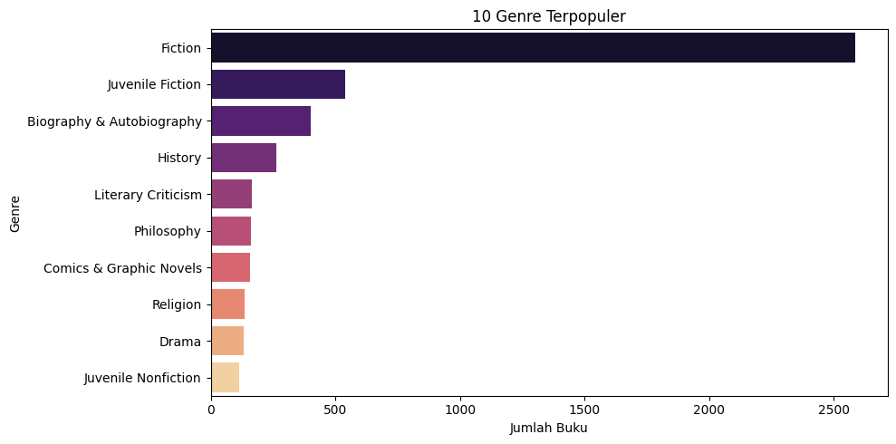
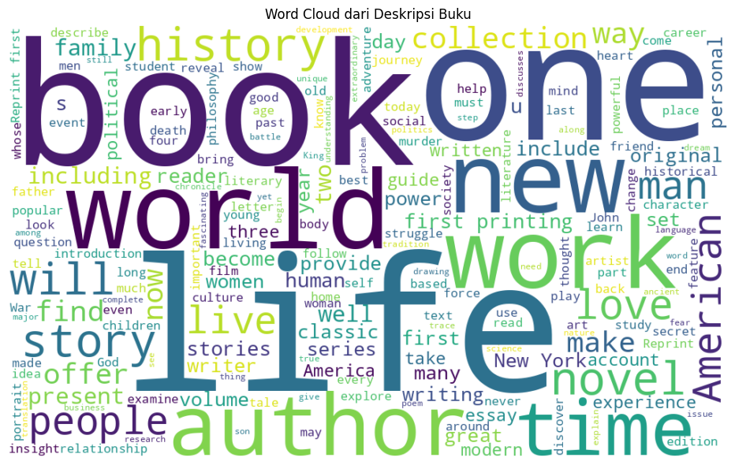

# Laporan Proyek Akhir Machine Learning Terapan - Ratu Chairunisa

## Project Overview

**Latar Belakang**

Di era digital saat ini, ledakan informasi telah mengubah cara kita berinteraksi dengan berbagai jenis konten, termasuk buku. Dengan jutaan judul buku yang tersedia di berbagai platform daring, mencari bacaan yang sesuai dengan selera pribadi dapat menjadi tugas yang melelahkan dan memakan waktu. Fenomena ini semakin diperparah dengan pertumbuhan pesat e-commerce dan platform literasi digital, di mana pengguna dihadapkan pada pilihan yang tak terbatas. Dalam konteks ini, sistem rekomendasi menjadi solusi krusial yang menjembatani kesenjangan antara ketersediaan buku yang melimpah dan kebutuhan pengguna untuk menemukan konten yang relevan dan menarik.

Persis dengan bagaimana sistem rekomendasi telah merevolusi pengalaman belanja online dan konsumsi media, penerapannya dalam domain buku menawarkan potensi yang besar. Sistem ini mampu mengidentifikasi pola preferensi dari data historis pengguna, seperti buku yang telah dibaca, diberi rating, atau diulas, untuk kemudian menyarankan judul-judul baru yang memiliki kemungkinan besar untuk disukai pengguna. Tanpa bantuan sistem ini, pengguna mungkin akan terpaku pada judul-judul populer atau rekomendasi yang didasarkan pada daftar terlaris umum, sehingga kehilangan kesempatan untuk mengeksplorasi niche atau menemukan "permata tersembunyi" yang sangat cocok dengan minat mereka.

**Lalu, Menurut Kalian Mengapa Proyek Ini Penting?**

Proyek ini sangat penting untuk dilaksanakan karena ada beberapa alasan utama:
- **Meningkatkan Pengalaman Pengguna**: Tujuan utama sistem rekomendasi adalah meningkatkan kepuasan pengguna dengan menyediakan rekomendasi yang personal dan relevan. Dengan sistem ini, pembaca dapat menghemat waktu dalam mencari buku, mengurangi kesulitan dalam memilih karena terdapat banyak pilihan, dan lebih sering menemukan bacaan yang benar-benar bisa dinikmati, yang pada akhirnya akan memperkaya pengalaman literasi mereka.
- **Mendukung Industri Buku**: Bagi platform e-commerce buku atau perpustakaan digital, sistem rekomendasi yang efektif dapat secara signifikan meningkatkan tingkat penjualan. Rekomendasi yang tepat bukan hanya mendorong pembelian berulang tetapi juga memperkenalkan pengguna pada berbagai judul dari penulis yang kurang dikenal atau genre yang mungkin belum pernah mereka jelajahi. Hal ini berkontribusi pada diversifikasi pasar dan mendukung ekosistem penerbitan yang lebih luas.
- **Mengatasi Tantangan Data**: Dataset buku, terutama dari platform literasi digital, seringkali menghadapi tantangan unik seperti halnya pengguna yang hanya membaca sebagian kecil buku yang ada dan masalah bagaimana merekomendasikan buku kepada pengguna baru atau buku baru. Proyek ini penting untuk mengeksplorasi dan menerapkan solusi inovatif, termasuk penggunaan teknik **Collaborative Filtering** dan **Content-Based Filtering**, untuk mengatasi tantangan ini dan menghasilkan rekomendasi yang akurat.

**Hasil Riset dan Artikel Relevan**:

Peran sistem rekomendasi dalam membantu pengguna menavigasi informasi dan produk yang sangat banyak telah diakui secara luas, termasuk dalam domain buku. *Rajpurkar et al. (2015) menjelaskan bahwa sistem rekomendasi telah berevolusi menjadi algoritma cerdas yang mampu memberikan hasil berupa rekomendasi kepada pengguna, sehingga mengurangi biaya dalam menentukan pilihan terbaik dari sekian banyak opsi yang tersedia. Sistem ini kini dapat diterapkan di berbagai domain, mulai dari e-commerce hingga keamanan jaringan, dalam bentuk layanan yang dipersonalisasi, memberikan keuntungan bagi konsumen maupun produsen melalui rekomendasi produk yang relevan.*

Lebih lanjut, *Rajpurkar et al. menekankan bahwa inti dari setiap sistem rekomendasi adalah dua entitas utama, yaitu pengguna dan item. Dalam konteks ini, algoritma rekomendasi bekerja dengan menggunakan data pelanggan dan data buku untuk menghasilkan saran bacaan yang sesuai. Studi mereka juga menegaskan pentingnya sistem rekomendasi dalam meningkatkan profitabilitas dan retensi pembeli, terutama dalam persaingan pasar buku online. Pendekatan yang mereka tawarkan menggabungkan teknik content-based filtering, collaborative filtering, dan association rule mining, untuk menghasilkan rekomendasi buku yang efisien dan efektif. Temuan ini memperkuat urgensi pengembangan sistem rekomendasi yang mengintegrasikan berbagai teknik guna mengatasi kompleksitas data dan preferensi pengguna, serta meningkatkan akurasi dalam memberikan rekomendasi yang relevan*.

**Referensi:**
Rajpurkar, S., Bhatt, D., Malhotra, P., Jha, A., & Dhir, A. (2015). Book Recommendation System. International Journal for Innovative Research in Science & Technology (IJIRST).

## Business Understanding

Pada dasarnya, permasalahan yang ingin diatasi oleh proyek ini adalah "kesulitan pengguna dalam menemukan buku yang relevan dan menarik di tengah melimpahnya judul yang sangat banyak." Ini bukan hanya tentang aksesibilitas buku, melainkan tentang kualitas penemuan. Meskipun banyak platform menyediakan katalog buku yang luas, tanpa sistem rekomendasi yang cerdas, pengguna seringkali kewalahan dan mungkin melewatkan buku-buku yang sebenarnya sangat cocok dengan selera mereka.
Masalah ini dapat diklarifikasi lebih lanjut menjadi beberapa poin:
- Pengguna dihadapkan pada jutaan pilihan, membuat keputusan memilih buku menjadi tugas yang memakan waktu dan seringkali tidak efisien.
- Terlalu banyak pilihan dapat menyebabkan kelumpuhan keputusan atau bahkan ketidakpuasan setelah memilih, karena khawatir ada pilihan yang lebih baik.
- Rekomendasi generik (misalnya, daftar buku terlaris) tidak memenuhi kebutuhan individu dan tidak mencerminkan preferensi unik setiap pembaca.
- Tanpa sistem yang baik, pengguna cenderung terpaku pada genre atau penulis yang sudah familiar, sehingga membatasi eksplorasi mereka terhadap buku-buku baru atau berbeda.
- Bagi platform e-commerce buku, kesulitan pengguna menemukan buku yang tepat dapat mengakibatkan penurunan tingkat penjualan yang stagnan, dan kurangnya retensi pelanggan.

### Problem Statements

Berdasarkan klarifikasi masalah di atas, berikut adalah pernyataan masalah yang jelas untuk proyek ini:
1. Bagaimana cara mengembangkan sistem rekomendasi buku yang mampu menyarankan judul-judul yang sangat relevan dan personal kepada pengguna, berdasarkan preferensi bacaan historis, rating pengguna, dan kategori buku?
2. Bagaimana meningkatkan pengalaman pengguna dalam menemukan buku yang relevan secara efisien dan otomatis?
3. Bagaimana sistem rekomendasi dapat membantu platform meningkatkan retensi pengguna dan potensi penjualan?

### Goals

Berdasarkan problem statements, berikut adalah tujuan utama yang ingin dicapai oleh proyek ini:
1. Mengembangkan sistem rekomendasi buku berbasis data pengguna dan fitur buku.
2. Memberikan saran buku yang relevan secara otomatis untuk meningkatkan kenyamanan pengguna.
3. Meningkatkan retensi dan kepuasan pengguna pada platform digital yang menyediakan buku.
4. Mengevaluasi dan membandingkan performa dua pendekatan sistem rekomendasi: content-based filtering dan collaborative filtering.

### Solution Approach

Untuk mencapai tujuan proyek ini, dua pendekatan sistem rekomendasi akan digunakan, yaitu Content-Based Filtering dan Collaborative Filtering.
- **Content-Based Filtering**
Pendekatan ini memberikan rekomendasi berdasarkan kemiripan antara item (dalam hal ini, buku) dan preferensi pengguna. Sistem akan menganalisis fitur-fitur buku seperti genre, author, atau deskription, lalu mencocokkannya dengan buku yang pernah disukai pengguna.
Metode ini cocok digunakan ketika informasi pengguna masih terbatas atau ketika pengguna baru (cold-start user).
- **Collaborative Filtering**
Pendekatan ini merekomendasikan buku berdasarkan kesamaan preferensi antar pengguna. Sistem mencari pengguna lain yang memiliki riwayat interaksi serupa, dan memberikan rekomendasi berdasarkan buku-buku yang disukai oleh pengguna serupa tersebut. Collaborative filtering sangat efektif ketika terdapat banyak data interaksi pengguna, seperti rating atau riwayat pembelian.

Kedua metode ini akan dibandingkan untuk mengevaluasi efektivitasnya dalam memberikan rekomendasi yang akurat dan relevan terhadap kebutuhan pengguna.

## Data Understanding

Dataset yang digunakan dalam proyek ini adalah kumpulan informasi komprehensif tentang buku. Setelah dilakukan pengecekan awal terhadap dataset, ditemukan bahwa dataset terdiri dari 6810 baris dan 12 kolom, tipe data yang dimiliki pada dataset ini terdiri dari float64(4), int64(1), dan object(7). Dataset yang diambil dari sumber terdeteksi outliers yang cukup ekstrem pada fitur numerik. kabar baiknya tidak terdapat data duplikat. Namun, masih terdapat data yang hilang pada beberapa entri. Oleh karena itu, tahap pembersihan data akan menjadi bagian penting dalam preprocessing. Berikut adalah beberapa fitur yang memiliki nilai kosong:
- subtitle (4429 data)
- authors (72 data)
- categories (99 data)
- thumbnail (329 data)
- description (262 data)
- published_year (6 data)
- average_rating (43 data)
- num_pages (43 data)
- ratings_count (43 data)

Dataset ini dirancang untuk mendukung pengembangan sistem rekomendasi dan aplikasi chatbot, menawarkan kekayaan detail yang relevan untuk machine learning, natural language processing (NLP), dan kecerdasan buatan di domain literatur. Dataset ini dapat diakses dan diunduh melalui platform Kaggle pada tautan berikut:[Books Dataset](https://www.kaggle.com/datasets/abdallahwagih/books-dataset)

Dataset ini kaya akan fitur yang dapat dimanfaatkan untuk berbagai teknik rekomendasi, berikut adalah fitur-fitur yang terdapat dalam dataset:
- isbn13 (ISBN13): fitur ini merupakan kode identifikasi unik internasional versi 13 digit untuk sebuah buku, dimana ISBN digunakan untuk membedakan satu buku dari buku lainnya secara global.
- **isbn10 (ISBN10):** fitur ini versi lama dari ISBN, hanya 10 digit. Namun, masih digunakan di beberapa tempat.
- **Judul (Title):** nama/ judul lengkap buku, bisa digunakan dalam pencarian atau tampilan antarmuka pengguna.
- **Penulis (Author):** nama penulis buku. Fitur kunci untuk rekomendasi berbasis konten dan pengelompokan.
- **Genre/Categories:** Kategori atau jenis buku (misalnya, Fiksi, Fantasi, Sejarah). Sangat berguna untuk content-based filtering.
- **Tahun Penerbitan (Published Year):** Tahun buku diterbitkan. Dapat menunjukkan tren atau relevansi waktu.
- **Sinopsis (Description):** ringkasan alur cerita atau tema buku. Penting untuk analisis teks dan content-based filtering yang mendalam.
- **Average Rating:** Skor atau nilai rata-rata yang diberikan pengguna pada buku.
- **Thumbnail (Images URL):** tautan atau lokasi gambar sampul buku. Berguna untuk representasi visual dalam antarmuka pengguna.
- **num_pages:** banyaknya halaman dari buku
- 
### Exploratory Data Analysis
**Visualisasi Data**:
* **Histogram Rata-Rata Rating**: untuk melihat sebaran rating. Mayoritas rating berada di antara 3 hingga 5, menunjukkan sebagian besar pengguna memberikan ulasan positif.
* **Bar Chart Top 10 Buku**: menampilkan top 10 buku berdasarkan rata-rata rating tertinggi dan ulasan terbanyak
* **Bar Chart Top 10 author dan genre terpopuler**: untuk mengetahui top 10 penulis dan genre buku paling populer. 

* **Word Cloud dari Deskripsi Buku**: dibuat untuk menemukan kata kunci yang sering muncul dalam deskripsi buku, seperti yang terlihat kata-kata umum yang sering muncul dalam deskripsi adalah 'life', 'one', 'book', 'novel', 'world', 'stroynew', 'work'.
  

## Data Preparation

Pada tahap persiapan data, beberapa teknik utama yang diterapkan untuk memastikan kualitas dan kelayakan data sebelum digunakan dalam pemodelan sistem rekomendasi adalah sebagai berikut:

**Handling missing values**: menangani data yang hilang (missing data) pada beberapa kolom penting yang akan digunakan pada pemodelan, berikut teknik yang digunakan berdasarkan tipe datanya:
  * Kolom authors diatasi menggunakan teknik imputasi dengan menggantinya dengan 'Unknown Author', hal ini dilakukan agar pada kolom authors tidak terdapat data kosong.
  * Kolom categories diatasi menggunakan teknik imputasi dengan menggantinya dengan 'Uncategorized'.
  * Kolom deskripsi diatasi dengan mengisi nilai Nan (null/missing) dengan string kosong, tujuannya agar baris tersebut tetap disertakan meskipun sebagian isinya kosong.
  * Kolom average_rating & num_pages diatasi menggunakan teknik imputasi dengan menggantinya dengan nilai median dari average_rating & num_pages, tujuannya untuk menjaga distribusinya tetap representatif.
  * Kolom ratings_count diatasi menggunakan teknik imputasi dengan mengisi dengan nilai kosong (0)
  * Kolom published_year diatasi dengan cara menghapus baris yang kosong, teknik ini dilakukan karena jumlah data yang hilang hanya sedikit dan penghapusan tidak akan memberikan pengaruh secara signifikan.

**Handling Outliers**: Outlier diatasi dengan teknik capping (winsorized) menggunakan metode IQR (Interquartile Range). Artinya, nilai-nilai ekstrem (outliers) tidak dihapus, tetapi dibatasi (dibatasi atas dan bawah) pada ambang batas yang wajar berdasarkan distribusi data. Teknik ini digunakan untuk mengurangi pengaruh outliers yang ekstrem, menjaga data tetap utuh, menstabilkan distribusi data, dan meningkatkan kerja model.

**Text Preprocessing (untuk Content-Based Filtering)**: dalam melakukan teks processing, dilakukan beberapa teknik berikut

**1. Lowercasing (Konversi ke huruf kecil):**
* Mengubah semua huruf menjadi huruf kecil (text.lower()).
* Tujuan: Agar kata seperti "Book" dan "book" dianggap sama (konsistensi kata).
  
**2. Punctuation Removal (Menghapus tanda baca):**
* Menghapus semua tanda baca (string.punctuation).
* Tujuan: Tanda baca biasanya tidak memberi makna penting dalam analisis teks (kecuali di NLP tingkat lanjut seperti analisis sentimen berbasis tanda baca).
  
**3. Digit Removal (Menghapus angka):**
* Menghapus semua angka (re.sub(r'\d+', '', text)).
* Tujuan: Angka umumnya tidak relevan dalam pemahaman makna konten buku, kecuali di domain tertentu.
  
**4. Tokenization:**
* Memecah teks menjadi daftar kata-kata (token) menggunakan nltk.word_tokenize().
* Tujuan: Agar teks bisa diproses secara individual kata demi kata (untuk filtering, stemming, dsb).
  
5. **Stopword Removal:**
* Menghapus kata-kata umum yang tidak membawa makna penting (seperti “the”, “is”, “and”) menggunakan stop_words.
* Tujuan: Mengurangi noise atau kata-kata yang tidak berkontribusi pada makna inti dokumen.
  
**6. Stemming (Porter Stemmer):**
* Mengubah kata ke bentuk dasarnya (contoh: reading → read).
* Tujuan: Menyatukan kata dengan akar yang sama agar dianggap satu makna. Ini penting untuk menghindari redundansi kata turunan.
  
**7. Rejoining:**
* Menggabungkan kembali token menjadi satu string (' '.join()).
* Tujuan: Agar data siap digunakan untuk proses selanjutnya, misalnya vectorization.

Semua teknik yang digunakan dalam teks processing ialah untuk untuk menyederhanakan teks, membersihkan noise, mempersiapkan teks untuk pemodelan, dan meningkatkan akurasi model.

**Normalisasi/Standarisasi (untuk fitur numerik)**: melakukan normalisasi pada kolom average_rating, num_pages, dan ratings_count ke skala 0 hingga 1. Tahapan ini krusial dalam data preprocessing karena membantu menyamakan skala antar fitur, menghindari bias, serta meningkatkan performa dan efisiensi model machine learning. Selain itu, normalisasi juga berguna dalam visualisasi dan pemahaman data yang lebih adil dan representatif.

## Modeling

Pada tahap modeling, tujuan utama adalah membangun sistem rekomendasi buku yang mampu memberikan daftar rekomendasi top-N buku terbaik untuk pengguna berdasarkan preferensi dan data yang tersedia. Sistem ini dirancang untuk mempermudah pengguna dalam menemukan buku yang relevan dan sesuai dengan minat mereka, sehingga meningkatkan pengalaman pengguna dan potensi interaksi dengan platform.
Untuk mencapai tujuan ini, akan disajikan dan mengimplementasikan dua solusi rekomendasi dengan algoritma yang berbeda, yaitu **Content-Based Filtering** dan **Collaborative Filtering**.

**1. Sistem Rekomendasi untuk Menyelesaikan Permasalahan**

Sistem rekomendasi yang dibangun agar sistem secara otomatis dan efisien menyarankan buku-buku yang paling mungkin sesuai dengan preferensi pengguna. 
Pendekatan yang dilakukan dalam proyek ini adalah memprediksi atau mengidentifikasi buku-buku yang paling relevan bagi seorang pengguna berdasarkan dua sudut pandang:

* **Dari perspektif buku itu sendiri (Content-Based Filtering):** Jika Anda menyukai buku dengan fitur X, Y, Z, maka sistem akan merekomendasikan buku lain yang juga memiliki fitur X, Y, Z.
  
* **Dari perspektif interaksi pengguna lain (Collaborative Filtering):** Jika Anda memiliki selera baca yang mirip dengan orang lain, maka sistem akan merekomendasikan buku yang disukai oleh orang lain tersebut, meskipun Anda belum pernah membaca buku dengan fitur serupa.
Kombinasi dan perbandingan kedua perspektif ini memberikan wawasan mendalam tentang cara terbaik untuk memenuhi kebutuhan pengguna.

**2. Top-N Recommendation**

Output utama dari sistem rekomendasi ini adalah daftar *Top-N Recommendation*. Ini berarti, ketika seorang pengguna meminta rekomendasi atau sistem secara proaktif ingin menyarankan buku, ia akan menyajikan daftar N buku teratas yang paling diprediksi akan disukai atau relevan bagi pengguna tersebut.

**Output Top-N Recommendation**
* **contoh Top-N Recommendation pada Algoritma Content-Based Filtering (CBF)**
Mencari berdasarkan judul terdekat: 'I'm Telling You Stories'

| No  | Title                         | Authors                                                  | Description                                               |
|-----|-------------------------------|-----------------------------------------------------------|-----------------------------------------------------------|
| 1   | Superheroes and Philosophy    | Thomas V. Morris; Matt Morris; William Irwin              | A collection of essays by various authors that...         |
| 2   | The Double Flame              | Octavio Paz                                               | A collection of essays examines the themes of ...         |
| 3   | Where We Are, what We See     | David Levithan                                            | A collection of poems, stories, essays, and ar...         |
| 4   | The Responsibility of Forms   | Roland Barthes                                            | These late essays of Roland Barthes's are conc...         |
| 5   | Star Wars and Philosophy      | Kevin S. Decker; William Irwin; Jason T. Eberl            | A collection of essays that address the philos...         |

* **contoh Top-N Recommendation pada Algoritma Collaborative Filtering (CF)**
Menampilkan rekomendasi mirip dengan:
* Judul: 'I'm Telling You Stories'
* ISBN: 9789042003408

| Index | Title                         | Authors                                     | Average Rating |
|-------|-------------------------------|---------------------------------------------|----------------|
| 4831  | The Power of One              | John C. Maxwell; Thomas G. Addington        | 0.856          |
| 4834  | The Blood of the Moon         | George Grant                                | 0.738          |
| 4836  | The Complete Dream Dictionary | Pamela Ball                                 | 0.744          |
| 4845  | Night Lives                   | Phyllis Eisenstein; Alex Eisenstein         | 0.900          |
| 6809  | 'I'm Telling You Stories'     | Helena Grice; Tim Woods                     | 0.740          |

3. **Kelebihan dan Kekurangan pada Pendekatan yang Dipilih (Content-Based Filtering dan Collaborative Filtering)**
Berikut adalah rekapitulasi kelebihan dan kekurangan dari setiap pendekatan, dengan mempertimbangkan hasil evaluasi yang telah diperoleh:

**a. Content-Based Filtering (CBF)**

* **Kelebihan:**
  * **Mengatasi *Cold Start* Problem untuk Item Baru:** CBF dapat merekomendasikan buku baru segera setelah metadata (judul, penulis, sinopsis/deskripsi) tersedia, tanpa perlu data interaksi dari pengguna lain. Ini terbukti dengan **Coverage yang sangat tinggi (0.8878)**, menunjukkan kemampuan model untuk menjangkau hampir seluruh katalog buku.
  * **Penjelasan yang Mudah (Explainability):** Karena rekomendasi didasarkan pada atribut eksplisit buku, lebih mudah untuk menjelaskan kepada pengguna mengapa sebuah buku direkomendasikan (misalnya, "Anda menyukai buku ini karena genre-nya sama dengan buku yang Anda baca sebelumnya").
  * **Personalisasi Awal:** CBF dapat membuat profil preferensi yang sangat spesifik untuk setiap pengguna.

* **Kekurangan:**
  * ***Overspecialization* (Filter Bubble):** Ini adalah kelemahan paling dominan, dan terlihat jelas dari hasil evaluasi **Precision@5 (0.0013)** dan **Recall@5 (0.0067)** yang sangat rendah. Model cenderung merekomendasikan buku yang sangat mirip dengan yang sudah disukai pengguna, sehingga membatasi penemuan genre atau penulis baru (serendipity rendah) dan berpotensi membuat pengalaman pengguna terasa repetitif.
  * **Cold Start* Problem untuk Pengguna Baru:** Jika seorang pengguna baru belum memiliki riwayat bacaan yang cukup, sulit bagi sistem untuk membangun profil preferensi yang akurat dan memberikan rekomendasi awal.
  * **Kualitas Tergantung Metadata:** Kinerja model sangat bergantung pada kelengkapan dan kualitas metadata konten buku.

**b. Collaborative Filtering (CF)**

* **Kelebihan:**
  * **Akurasi Tinggi dan Personalisasi Efektif:** Hasil evaluasi menunjukkan **CF jauh lebih efektif** dalam memberikan rekomendasi yang relevan dan personal, dengan P**recision@5 (0.0947), Recall@5 (0.4459), F1-Score@5 (0.1551)**, dan **Hit Rate@5 (0.4735)** yang secara signifikan lebih tinggi. Ini membuktikan kemampuannya untuk menangkap pola preferensi pengguna dan memberikan rekomendasi yang "tepat sasaran."
  * **Menemukan "Permata Tersembunyi" (Serendipity):** CF mampu merekomendasikan buku yang mungkin tidak memiliki atribut konten yang sama persis dengan yang disukai pengguna, tetapi disukai oleh pengguna lain dengan selera serupa. Ini mendorong penemuan yang tidak terduga dan memperkaya pengalaman membaca.
  * **Tidak Membutuhkan Metadata Item:** CF tidak perlu "memahami" konten buku itu sendiri; ia hanya memerlukan data interaksi (rating, riwayat baca).

* **Kekurangan:**
  * ***Cold Start Problem* (Pengguna Baru dan Item Baru):** Ini adalah kelemahan signifikan. **CF kesulitan merekomendasikan buku kepada pengguna baru (karena tidak ada riwayat interaksi)** atau buku baru (karena belum banyak diulas). Meskipun Coverage CF (0.7945) cukup tinggi, ini mungkin masih terbatas pada buku-buku yang sudah memiliki interaksi.
  * ***Data Sparsity Problem:*** Dataset interaksi pengguna-item cenderung sangat jarang. Jika ada terlalu sedikit rating atau interaksi, CF mungkin kesulitan menemukan pola kesamaan yang kuat antar pengguna atau item, yang dapat menurunkan akurasi.
  * ***Scalability Issue:*** Untuk dataset yang sangat besar dengan jutaan pengguna dan buku, perhitungan kesamaan dan matriks interaksi bisa menjadi sangat intensif secara komputasi dan memakan banyak memori.

Berdasarkan dua perbandingan ini, **Collaborative Filtering terbukti menjadi pendekatan yang lebih efektif dalam mencapai tujuan inti proyek terkait relevansi dan personalisasi rekomendasi** dengan data yang miliki. Namun, CBF memiliki keunggulan dalam cakupan item yang luas, yang sangat penting untuk penanganan buku-buku baru.

## Evaluation
Yay! setelah melewati berbagai tahap, tibalah di tahap evaluasi. Dalam mengevaluasi performa sistem rekomendasi buku, digunakan beberapa metrik evaluasi yang umum dan sesuai dengan konteks problem rekomendasi top-N, yaitu:
- **Precision@N**
- **Recall@N**
- **F1-Score@N**
- **MRR**
- **Hit Rate@N**
- **Coverage**

### Hasil Proyek Berdasarkan Metrik Evaluasi
Setelah melatih dan menguji kedua model (Content-Based Filtering dan Collaborative Filtering) pada dataset, berikut adalah ringkasan kinerja masing-masing model berdasarkan metrik yang telah ditentukan:

| Metrik Evaluasi   | Content-Based Filtering (CBF) | Collaborative Filtering (CF) |
|------------------|-------------------------------|-------------------------------|
| Precision@5      | 13                            | 947                           |
| Recall@5         | 67                            | 4.459                         |
| F1-Score@5       | 22                            | 1.551                         |
| MRR              | 60                            | 1.054                         |
| Hit Rate@5       | 67                            | 4.735                         |
| Coverage         | 8.878                         | 7.945                         |

### Analisis Komparatif Hasil:
Dari hasil evaluasi di atas, terlihat perbedaan kinerja yang sangat signifikan antara kedua pendekatan, mari kita bahas lebih detail dengan mengaitkannya dengan problem statement (PS) dan goals dalam proyek ini:

**1. Relevansi dan Personalisasi (Menjawab PS1 & Goal 2):**
* **Collaborative Filtering (CF)** jelas menunjukkan performa yang jauh lebih unggul dalam menyajikan rekomendasi yang relevan dan personal. Dengan **Precision@5 sebesar 0.0947**, artinya dari setiap 5 rekomendasi yang diberikan CF, rata-rata hampir 1 buku (sekitar 0.47 atau 47% dari 5 rekomendasi) adalah buku yang relevan dan mungkin disukai pengguna. **Ini jauh lebih baik dibandingkan CBF yang memiliki Precision@5 hanya 0.0013**, yang berarti sangat sedikit dari 5 rekomendasi CBF yang relevan.
* **Recall@5 CF (0.4459)** yang jauh lebih tinggi daripada **CBF (0.0067)** menunjukkan bahwa CF lebih mampu menangkap proporsi yang lebih besar dari semua buku relevan yang seharusnya direkomendasikan kepada pengguna.
* **F1-Score@5** mengkonfirmasi dominasi CF (0.1551) atas CBF (0.0022), yang berarti CF memiliki keseimbangan yang jauh lebih baik antara ketepatan dan cakupan rekomendasi.

**2. Efisiensi Penemuan Buku (Menjawab PS2 & Goal 2):**
* **MRR (Mean Reciprocal Rank)** CF (0.1054) yang lebih tinggi menunjukkan bahwa ketika CF berhasil merekomendasikan buku yang relevan, buku tersebut cenderung muncul lebih awal dalam daftar rekomendasi dibandingkan CBF (0.0060). Hal ini sangat penting untuk **kenyamanan pengguna**, karena mereka tidak perlu menggulir terlalu jauh untuk menemukan sesuatu yang mereka minati.
* **Hit Rate@5** CF (0.4735) secara signifikan lebih tinggi dari CBF (0.0067). Ini berarti hampir setengah dari pengguna (sekitar 47.35%) akan menemukan setidaknya satu buku relevan dalam 5 rekomendasi teratas yang diberikan CF, dibandingkan dengan CBF yang hampir tidak pernah memberikan hit relevan dalam 5 teratas. Ini adalah indikator langsung keberhasilan sistem dalam membantu pengguna menemukan buku.

**3. Potensi Retensi dan Kepuasan Pengguna (Menjawab PS3 & Goal 3):**
* Kinerja CF yang superior dalam metrik relevansi (Precision, Recall, F1-Score, MRR, Hit Rate) **secara langsung mendukung tujuan peningkatan retensi dan kepuasan pengguna**. Ketika pengguna secara konsisten menerima rekomendasi yang relevan dan berguna, pengalaman mereka di platform akan meningkat, mendorong mereka untuk lebih sering kembali dan merasa lebih puas.

**4. Cakupan Rekomendasi:**
* **Coverage CBF** (0.8878) lebih tinggi daripada CF (0.7945). Ini menunjukkan bahwa model CBF memiliki kemampuan untuk merekomendasikan proporsi buku yang lebih besar dari keseluruhan katalog (hampir 89%), dibandingkan CF (sekitar 79%). Meskipun CBF menawarkan cakupan yang lebih luas, relevansi rendahnya menjadi masalah. CF, di sisi lain, lebih efisien dalam menemukan rekomendasi yang relevan, meskipun mungkin pada subset buku yang lebih kecil. Ini mengindikasikan bahwa CBF tidak mengalami masalah cold start pada item baru seperti halnya CF, namun rekomendasi yang diberikan seringkali tidak "tepat sasaran".

**Kesimpulan Hasil Proyek**:
Berdasarkan hasil evaluasi ini, **Collaborative Filtering** (CF) **terbukti menjadi pendekatan yang lebih efektif dan akurat dalam menyediakan rekomendasi buku yang relevan dan personal, serta secara signifikan meningkatkan peluang pengguna menemukan buku yang mereka sukai**. CF lebih mampu menangkap pola preferensi pengguna dan memberikan rekomendasi yang berdampak positif pada pengalaman penemuan buku.

Meskipun demikian, **Content-Based Filtering** menunjukkan potensi dalam hal cakupan yang luas, yang bisa menjadi aset untuk mengatasi masalah cold start pada buku-buku baru atau niche yang belum banyak memiliki interaksi.

### Penjelasan Metrik Evaluasi yang Digunakan untuk Mengukur Kinerja Model

1. **Precision@N**
* Formula:
Precision@N = Jumlah total item relevan dalam K rekomendasi / Jumlah total K rekomendasi
* **Cara Kerja:** Metrik ini mengukur ketepatan rekomendasi. Untuk setiap pengguna, sistem menghasilkan daftar N rekomendasi teratas. Precision@N kemudian menghitung proporsi item dalam daftar tersebut yang benar-benar relevan bagi pengguna (yaitu, buku yang diberi rating tinggi oleh pengguna di data uji atau yang disukai berdasarkan kriteria relevansi lainnya). Nilai yang tinggi menunjukkan bahwa model sangat akurat dalam memberikan rekomendasi yang diinginkan, sehingga meningkatkan personalisasi dan kenyamanan pengguna.

2. **Recall@N**
* Formula:
Recall@K = Jumlah total item relevan dalam K rekomendasi / Jumlah total item relevan
* **Cara Kerja:** Metrik ini mengukur cakupan atau kelengkapan rekomendasi. Untuk setiap pengguna, Recall@N menghitung proporsi item relevan yang berhasil ditemukan oleh model dalam N rekomendasi teratas, dari semua item relevan yang sebenarnya tersedia untuk pengguna tersebut. Nilai yang tinggi menunjukkan bahwa model mampu menemukan sebagian besar item yang relevan, yang krusial untuk meningkatkan pengalaman pengguna dalam menemukan buku.

3. **F1_Score@N**
* Formula:F1-Score@K = 2 × (Precision@K × Recall@K) / (Precision@K + Recall@K)
* **Cara Kerja:** F1-Score adalah rata-rata harmonik dari Precision dan Recall. Metrik ini memberikan keseimbangan antara kedua metrik tersebut, sangat berguna ketika ada trade-off antara precision dan recall. Nilai F1-Score yang tinggi menunjukkan bahwa model memiliki performa yang baik dalam kedua aspek: **akurasi dan kelengkapan**. Ini menjadi metrik kunci untuk membandingkan performa dua pendekatan sistem rekomendasi secara komprehensif.

4. **Mean Reciprocal Rank (MRR)**
* Formula:
MRR = (1 / |U|) × Σ (1 / rank_u)
* **Cara Kerja:** MRR sangat relevan untuk skenario di mana urutan rekomendasi itu penting. Ia menghitung peringkat item relevan pertama untuk setiap pengguna, kemudian mengambil rata-rata kebalikannya. Semakin tinggi nilai MRR, semakin cepat (semakin di atas daftar) pengguna menemukan item yang relevan, yang secara langsung meningkatkan kenyamanan pengguna dalam menelusuri rekomendasi.

5. **Hit Rate@N**
* Formula:
HitRate@K = Jumlah pengguna dengan setidaknya satu hit dalam K / Jumlah total pengguna
* **Cara Kerja:** Metrik ini menjawab pertanyaan dasar: "Berapa banyak pengguna yang berhasil menemukan setidaknya satu rekomendasi yang relevan dalam daftar N teratas mereka?" Ini adalah metrik binary (ya/tidak) per pengguna, yang kemudian dirata-ratakan di seluruh populasi pengguna. Hit Rate@N yang tinggi menunjukkan bahwa sebagian besar pengguna akan mendapatkan pengalaman positif dari sistem, berkontribusi pada peningkatan retensi dan kepuasan pengguna.

6. **Coverage**
* Formula:
Coverage = Jumlah item unik yang direkomendasikan / Jumlah total item unik dalam katalog
* **Cara Kerja:** Metrik ini mengukur seberapa luas sistem rekomendasi dapat merekomendasikan item dari keseluruhan item buku terdaftar. Coverage yang tinggi berarti model tidak hanya merekomendasikan item-item populer saja, tetapi juga mampu "menjangkau" beragam buku. Ini penting untuk mengatasi filter bubble dan meningkatkan eksplorasi pengguna, serta relevan dengan pengembangan sistem rekomendasi berbasis fitur buku.
